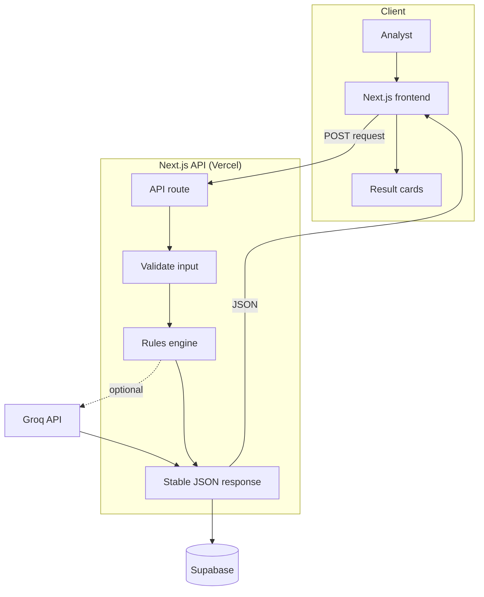
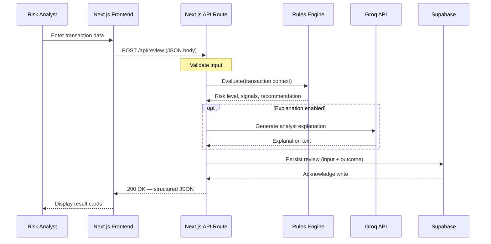
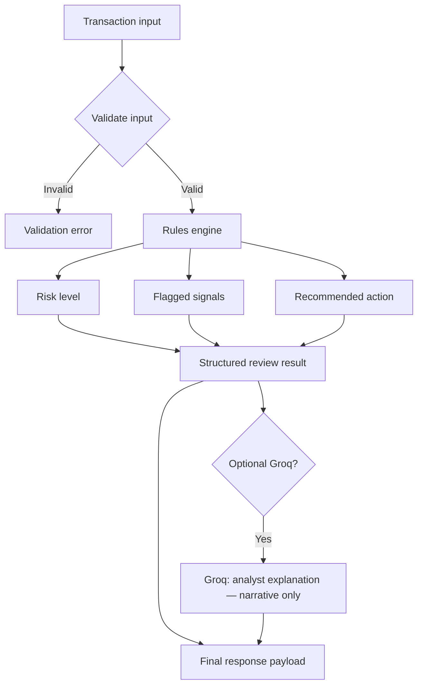
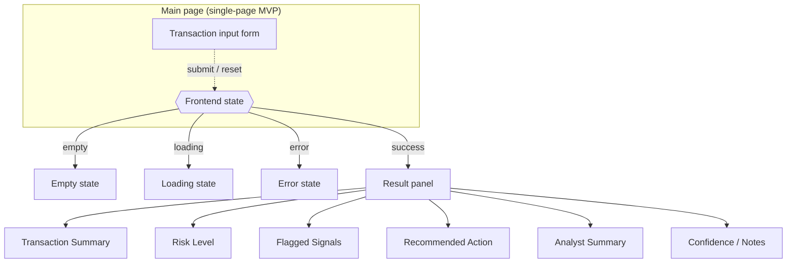
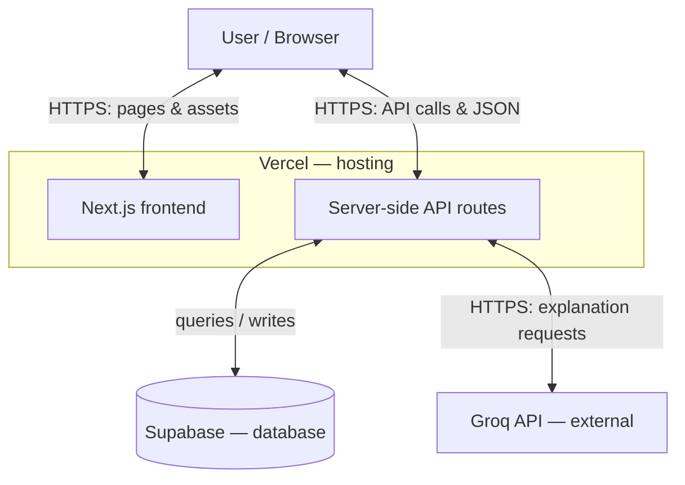

# Payment Risk Reviewer

AI-assisted transaction review for payment risk teams: **risk level**, **flagged signals**, **recommended action** (approve / review / block), and an **analyst-facing explanation** from Groq.

**Rules-first MVP:** a TypeScript **rules engine** decides the outcome. **Groq** generates explanation text from the same structured inputs; it does **not** override the recommendation. Reviews are stored in **Supabase**.

**Stack:** Next.js · TypeScript · Supabase · Groq API · Vercel

---

## Architecture

| Layer | Responsibility |
|--------|----------------|
| **Frontend** | Transaction form, result cards, loading / empty / error / success |
| **API routes** | Validate input, run rules, call Groq when enabled, persist to Supabase, return JSON |
| **Rules engine** | Deterministic thresholds, flags, scoring |
| **Groq** | Explanation layer only (narrative from rule outputs) |
| **Supabase** | PostgreSQL persistence for reviews |

The browser talks to **Next.js API routes** on Vercel. Groq and Supabase credentials are server-side environment variables.

---

## Diagrams

GitHub renders the Mermaid diagrams below.

### High-level request flow

### Request/response: `POST /api/review`

### Rules-first evaluation

### Frontend UI

### Deployment

---

## API & data

**`POST /api/review`** — Validate the body, run the rules engine, optionally attach a Groq explanation, write to Supabase, return JSON.

**`reviews` table**

| Column | Type / role |
|--------|-------------|
| `id` | UUID primary key |
| `created_at` | Timestamp |
| `input` | JSONB — request payload |
| `risk_level` | Text |
| `recommendation` | Text |
| `signals` | JSONB |
| `rules_version` | Text (e.g. `v1`) |
| `explanation` | Text |
| `model` | Text, nullable (Groq model id) |

---

## Roadmap

- Auth and Supabase RLS for multi-tenant demos  
- Richer rules and explicit rule versioning  
- Queues or async evaluation if volume grows  

---

## Development

Clone the repository. When the Next.js app is in-repo: **`pnpm install`**, **`pnpm dev`**.

---

## License

See [LICENSE](./LICENSE).
