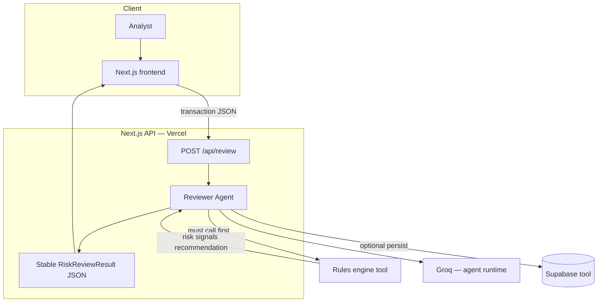
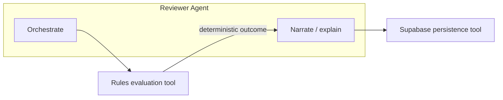
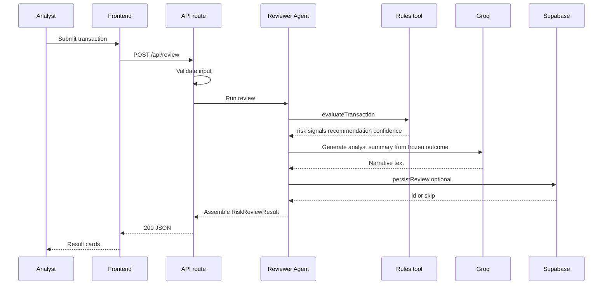
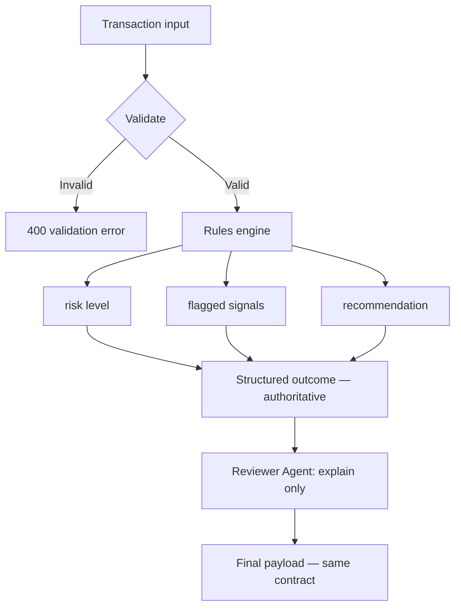
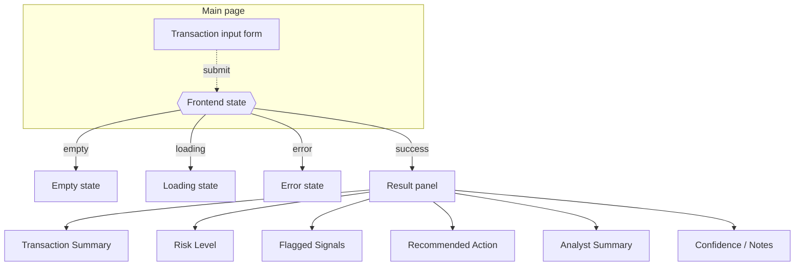
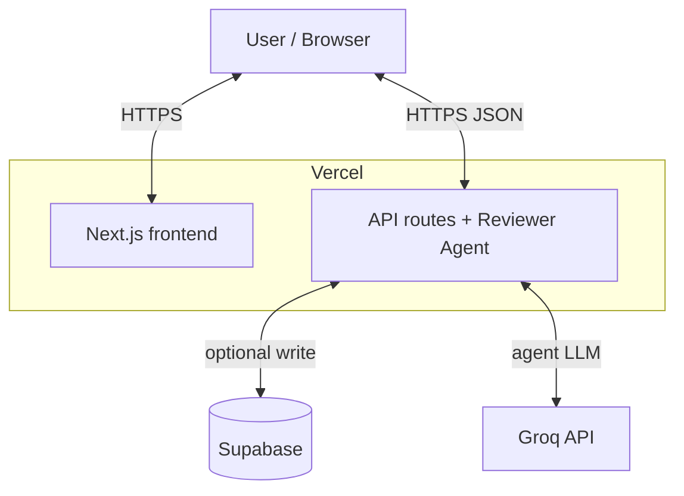

# Payment Risk Reviewer

AI-assisted transaction review for payment risk teams: **risk level**, **flagged signals**, **recommended action** (approve / review / block), and an **analyst-facing narrative** produced by the **Reviewer Agent** (Groq).

**Decision backbone:** a TypeScript **rules engine** is the **source of truth** for risk level, flagged signals, and recommendation. The **Reviewer Agent** orchestrates each review, **always** runs the rules evaluation first, then interprets and explains those outputs—**never** overriding deterministic results. Reviews are stored in **Supabase** when configured.

**Stack:** Next.js · TypeScript · Supabase · Groq API (Reviewer Agent) · Vercel

**Full agent spec:** [docs/REVIEWER_AGENT.md](./docs/REVIEWER_AGENT.md)

---

## Architecture

| Layer | Responsibility |
|--------|----------------|
| **Frontend** | Transaction form, result cards, loading / empty / error / success |
| **API routes** | Validate input, invoke Reviewer Agent, return stable JSON |
| **Reviewer Agent (Groq)** | Orchestration, analyst summary, structured narrative; calls tools in order |
| **Rules engine (tool)** | Deterministic thresholds, flags, scoring — **authoritative** for risk / signals / recommendation |
| **Supabase (tool)** | Optional persistence of the final review payload |
| **Groq API** | LLM runtime for the single Reviewer Agent |

The browser talks only to **Next.js** on Vercel. Groq and Supabase credentials are **server-side** environment variables.

---

## Diagrams

GitHub renders the Mermaid diagrams below.

### Reviewer Agent + stable JSON (high level)

### Agent + tools interaction

### End-to-end sequence

### Rules-first decision backbone

### Frontend UI (unchanged contract)

### Deployment

---

## One-line summary for demos

The **Reviewer Agent** (Groq) orchestrates each review: it **always** runs the **deterministic rules engine** first, then writes the **analyst-facing** narrative and returns the **same JSON** the UI already uses. **Supabase** stores the record when configured.

---

## API & data

**`POST /api/review`** — Validates the body, runs the Reviewer Agent pipeline (rules tool → Groq explanation → optional Supabase persist), returns **`RiskReviewResult`** JSON.

**`reviews` table**

| Column | Type / role |
|--------|---------------|
| `id` | UUID primary key |
| `created_at` | Timestamp |
| `input` | JSONB — request payload |
| `risk_level` | Text |
| `recommendation` | Text |
| `signals` | JSONB |
| `rules_version` | Text (e.g. `mvp-1`) |
| `explanation` | Text — final analyst summary |
| `model` | Text, nullable (Groq model id) |

---

## Roadmap

- Auth and Supabase RLS for multi-tenant demos  
- Richer rules and explicit rule versioning  
- Queues or async evaluation if volume grows  

---

## Development

Clone the repository. **`pnpm install`**, **`pnpm dev`**.

**Environment:** copy `.env.example` to `.env.local`. For the full agent pipeline, set **`GROQ_API_KEY`**. Use **`ENABLE_GROQ_EXPLANATION=false`** only if you need template-only summaries (e.g. offline demo). Supabase vars are optional for persistence.

---

## License

See [LICENSE](./LICENSE).
