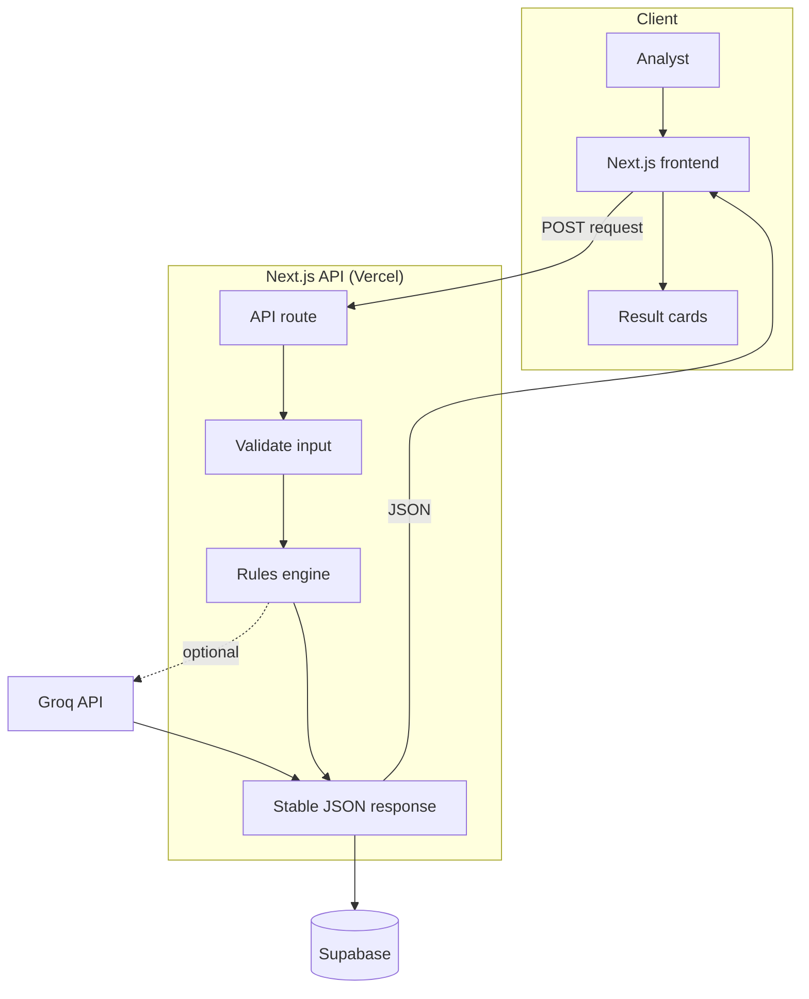
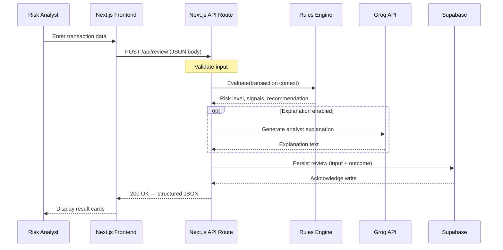
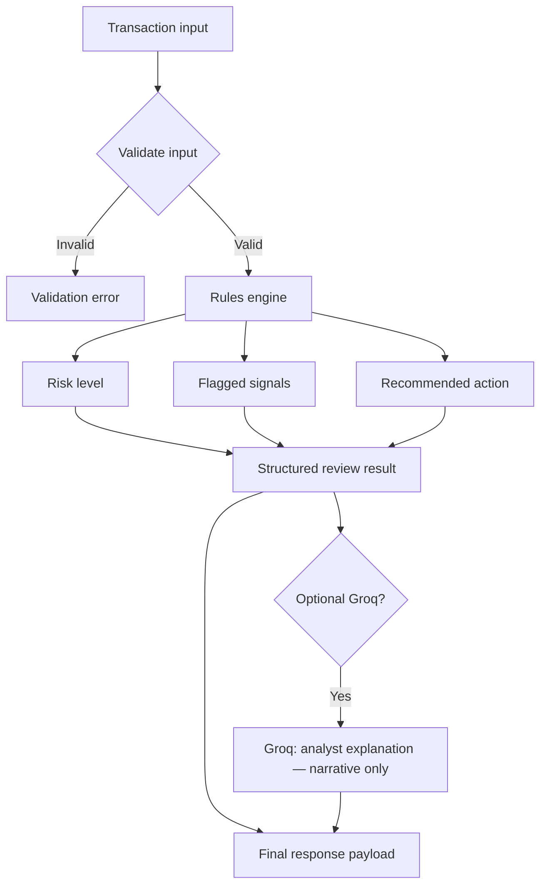
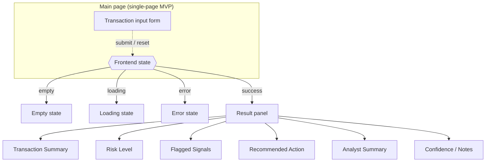
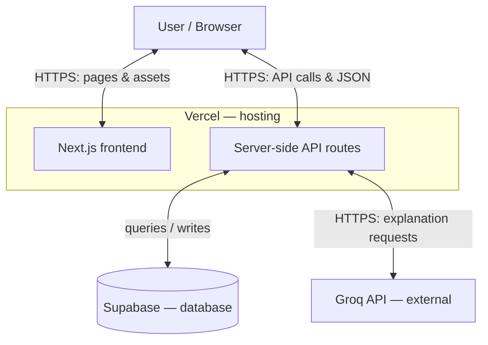

# Payment Risk Reviewer

AI-assisted decision support for payment and risk teams. Review a transaction, see flagged signals, a recommended action (approve, review, or block), and a short analyst-friendly explanation.

**Stack:** Next.js · TypeScript · Supabase · Groq API · Vercel

---

## How it works

Payment Risk Reviewer combines **deterministic rules** with an optional **AI-generated explanation**.

You submit transaction context through the web UI. The backend **always** runs a rules engine first: it produces a **risk level**, a **recommended action**, and **flagged signals**. The app may then call **Groq** to turn that structured outcome into a readable summary. **Rules drive the decision**; the model explains it and does not override the recommendation in the MVP.

Reviews can be **stored in Supabase** for demo history and basic auditability.

---

## Architecture

The app is a **Next.js** (TypeScript) project, deployed on **Vercel**. The browser talks to **Next.js API routes** only—privileged keys for Groq and the database stay on the server.

| Layer | Role |
|--------|------|
| **Frontend** | Transaction input, card-based results (signals, recommendation, explanation), loading and error states |
| **API routes** | Validate input, run evaluation, return a **stable JSON** contract for the UI |
| **Rules engine** | TypeScript logic: thresholds, flags, scoring—fast, testable, pitch-friendly |
| **Groq** | Optional narrative layer from structured inputs + rule outputs |
| **Supabase (PostgreSQL)** | Persist review records (inputs and outcomes) |

Environment variables on Vercel configure the Groq API key and Supabase credentials.

---

## Data flow

1. The user submits transaction data from the client.
2. The client sends **one POST request** (for example to `/api/review`) with a JSON body.
3. The server **validates** the payload and runs the **rules engine** to compute risk level, recommendation, and signals.
4. If enabled, the server calls **Groq** and merges an **explanation** into the response. If Groq fails, the API still returns full rule results with a short fallback message.
5. The server **writes** a row to Supabase.
6. The client renders **cards**: signals list, recommendation, explanation.

---

## Diagrams

Mermaid diagrams render on GitHub. They summarize architecture, request flow, UI structure, and deployment.

### High-level request flow

The analyst uses the Next.js UI to submit transaction context; the app calls a server API route that validates input, runs the rules engine, optionally enriches with Groq, persists to Supabase, and returns one stable JSON payload mapped to result cards.



### Request/response sequence (`POST /api/review`)

This sequence shows the happy path: validate → rules → optional Groq → persist → structured JSON → UI.



### Rules-first evaluation logic

Rules always produce risk level, signals, and recommendation; Groq only adds narrative text and does not override the core recommendation in the MVP.



### Frontend UI architecture

The main page combines a transaction form with a single state machine; on success, a result panel renders card-based sections for a clean enterprise SaaS layout.



### Deployment architecture

The browser talks to Vercel for the Next.js UI and API routes; API routes connect to Supabase and the Groq API. Secrets stay server-side.



### System diagram (text)

```
┌─────────────┐     POST JSON      ┌──────────────────────┐
│   Browser   │ ─────────────────► │  Next.js API route   │
│  (Next.js)  │                    │  (validate + merge)  │
└─────────────┘                    └──────────┬───────────┘
       ▲                                      │
       │                                      ├──► Rules engine → risk, action, signals
       │                                      │
       │                                      ├──► Groq API → explanation (optional)
       │                                      │
       │                                      └──► Supabase → persist review
       │                                      │
       └──────── JSON response ───────────────┘
```

---

## API and data model (planned)

**Primary route:** `POST /api/review` — evaluate, optionally explain, persist.

**Example table: `reviews`**

| Column | Notes |
|--------|--------|
| `id` | UUID primary key |
| `created_at` | Timestamp |
| `input` | JSONB — request payload |
| `risk_level` | e.g. low / medium / high |
| `recommendation` | e.g. approve / review / block |
| `signals` | JSONB — structured flags |
| `rules_version` | e.g. `v1` |
| `explanation` | Text from Groq or fallback |
| `model` | Optional Groq model id |

Additional read-only routes (for example listing recent reviews) are optional for the MVP.

---

## Future improvements

- **Auth and tenancy:** User or organization scoping and Supabase row-level security.
- **Richer rules:** More signals, versioned rule packs, and reproducible evaluations.
- **Async evaluation:** Queues for scale or slower downstream checks.
- **Observability:** Dashboards on outcomes and latency without breaking the API contract.
- **Model flexibility:** Swap LLM providers while keeping “rules first, narrative second.”

---

## Development

Clone the repository. Run and deployment instructions will be added as the Next.js app is scaffolded (`pnpm` as package manager).

---

## License

See [LICENSE](./LICENSE).
